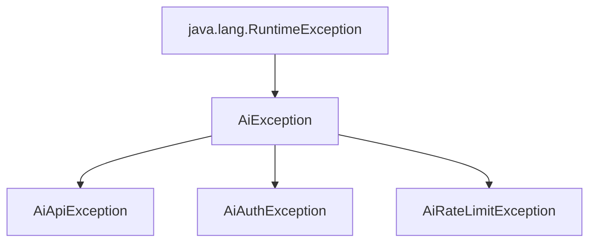

# API Reference: `sidd-ai`

Welcome to the complete API reference for the `sidd-ai` Java SDK. This guide documents every class, interface, method, constructor, and exception in the package. Use this reference to integrate `sidd-ai` into your Java applications or to understand its internal structure when publishing the library.

---

## 1. Core Client Facade

### `io.github.prabhusiddarth.sidd_ai.AiClient`

The central facade of the library. It orchestrates routing, applies client credentials (API keys or custom hosts), instantiates providers, and handles chat interactions.

#### Fields
* `private final String defaultModel`: The model name to use when invoking `chat(String prompt)` without specifying a model.
* `private final String openAiApiKey`: Custom API key override for OpenAI.
* `private final String geminiApiKey`: Custom API key override for Google Gemini.
* `private final String anthropicApiKey`: Custom API key override for Anthropic Claude.
* `private final String ollamaHost`: Custom host URL override for Ollama.
* `private final String grokApiKey`: Custom API key override for xAI Grok.
* `private final String groqApiKey`: Custom API key override for Groq.
* `private final String nimApiKey`: Custom API key override for NVIDIA NIM.
* `private final String kimiApiKey`: Custom API key override for Moonshot AI Kimi.

#### Constructors
* `private AiClient(Builder builder)`
  * **Description**: Private constructor called only by `AiClient.Builder`. Initializes credentials and defaults.

#### Public Static Methods
* `public static Builder builder()`
  * **Description**: Instantiates a new builder instance to configure and create an `AiClient`.
  * **Returns**: `AiClient.Builder`
* `public static String chatQuick(String model, String prompt)`
  * **Description**: Quick, zero-setup static utility method to call any model. Automatically resolves API keys/hosts from environment variables or local `.env` file via `EnvHelper`. Delegates routing to `ModelRouter`.
  * **Parameters**:
    * `model`: The model identifier (e.g., `"gpt-4o"`, `"gemini-2.5-flash"`, `"grok-4.3"`, `"openai/gpt-oss-20b"`).
    * `prompt`: The text instruction to send.
  * **Returns**: `String` containing the response text content.
  * **Throws**: `AiException` (or subclass) on authentication, rate limit, or communication failure.

#### Public Instance Methods
* `public String chat(String prompt)`
  * **Description**: Sends a prompt to the configured `defaultModel`.
  * **Parameters**:
    * `prompt`: The text instruction to send.
  * **Returns**: `String` containing the response text content.
  * **Throws**:
    * `IllegalStateException`: If `defaultModel` was not configured on the client builder.
    * `AiException`: On API failures.
* `public String chat(String model, String prompt)`
  * **Description**: Sends a prompt to a specific model using the client's configured credentials. Provider is inferred from the model string prefix.
  * **Parameters**:
    * `model`: The model identifier.
    * `prompt`: The text instruction.
  * **Returns**: `String` containing the response text content.
* `public ChatResponse chatResponse(String model, String prompt)`
  * **Description**: Sends a prompt and returns the full response metadata (including token usage). Provider is inferred from the model string prefix.
  * **Parameters**:
    * `model`: The model identifier.
    * `prompt`: The text instruction.
  * **Returns**: `ChatResponse` containing text content, model name, and token usage statistics.
* `public String chatWithProvider(String providerKey, String model, String prompt)`
  * **Description**: Sends a prompt using an **explicitly named** provider key, bypassing prefix-based inference. Useful for menu-driven UIs or when the caller already knows which provider to use.
  * **Parameters**:
    * `providerKey`: One of `"openai"`, `"gemini"`, `"anthropic"` / `"claude"`, `"grok"`, `"nim"` / `"nvidia"`, `"kimi"` / `"moonshot"`, `"ollama"`.
    * `model`: The model identifier to pass to the provider.
    * `prompt`: The text instruction.
  * **Returns**: `String` content.
  * **Throws**: `IllegalArgumentException` if `providerKey` is unknown.
* `public ChatResponse chatResponseWithProvider(String providerKey, String model, String prompt)`
  * **Description**: Same as `chatWithProvider` but returns the full `ChatResponse`.
  * **Returns**: `ChatResponse`.
* `public ChatResponse chatResponse(String providerKey, String model, String prompt)`
  * **Description**: Overloaded convenience method. Identical behavior to `chatResponseWithProvider`.
  * **Returns**: `ChatResponse`.

---

### `io.github.prabhusiddarth.sidd_ai.AiClient.Builder`

Builder pattern implementation to configure and instantiate `AiClient` instances.

#### Methods
* `public Builder defaultModel(String defaultModel)`
  * **Description**: Sets the default model for client-scoped calls.
  * **Returns**: `Builder` (fluent interface)
* `public Builder openAiApiKey(String openAiApiKey)`
  * **Description**: Manually sets the OpenAI API key (bypassing environment variable checks).
  * **Returns**: `Builder`
* `public Builder geminiApiKey(String geminiApiKey)`
  * **Description**: Manually sets the Google Gemini API key.
  * **Returns**: `Builder`
* `public Builder anthropicApiKey(String anthropicApiKey)`
  * **Description**: Manually sets the Anthropic Claude API key.
  * **Returns**: `Builder`
* `public Builder ollamaHost(String ollamaHost)`
  * **Description**: Manually sets the host URL for Ollama local service (defaults to `http://localhost:11434`).
  * **Returns**: `Builder`
* `public Builder grokApiKey(String grokApiKey)`
  * **Description**: Manually sets the xAI Grok API key (bypassing `GROK_API_KEY` env var).
  * **Returns**: `Builder`
* `public Builder groqApiKey(String groqApiKey)`
  * **Description**: Manually sets the Groq API key (bypassing `GROQ_API_KEY` env var).
  * **Returns**: `Builder`
* `public Builder nimApiKey(String nimApiKey)`
  * **Description**: Manually sets the NVIDIA NIM API key (bypassing `NIM_API_KEY` env var).
  * **Returns**: `Builder`
* `public Builder kimiApiKey(String kimiApiKey)`
  * **Description**: Manually sets the Moonshot AI Kimi API key (bypassing `KIMI_API_KEY` env var).
  * **Returns**: `Builder`
* `public AiClient build()`
  * **Description**: Builds and returns an immutable `AiClient` instance configured with the specified parameters.
  * **Returns**: `AiClient`

---

## 2. Models & Core Types

### `io.github.prabhusiddarth.sidd_ai.Chat` (Interface)

Contract implemented by all model providers (`OpenAiChat`, `GeminiChat`, `GrokChat`, etc.). Defines standard synchronous API interaction strategies.

#### Methods
* `ChatResponse callResponse(String prompt)`
  * **Description**: Abstract method to initiate a raw prompt call and return the fully populated response model.
  * **Parameters**:
    * `prompt`: Raw text input.
  * **Returns**: `ChatResponse`
* `default String call(String prompt)`
  * **Description**: Default wrapper returning only the text content.
  * **Parameters**:
    * `prompt`: Raw text input.
  * **Returns**: `String` content, or `null` if the response is empty.
* `default ChatResponse callResponse(ChatRequest request)`
  * **Description**: Default wrapper mapping a rich `ChatRequest` configuration to the target API call.
  * **Parameters**:
    * `request`: Configured `ChatRequest` object.
  * **Returns**: `ChatResponse`
* `default String call(ChatRequest request)`
  * **Description**: Default wrapper returning only the text content from a rich `ChatRequest` transaction.
  * **Parameters**:
    * `request`: Configured `ChatRequest` object.
  * **Returns**: `String` content.

---

### `io.github.prabhusiddarth.sidd_ai.ChatRequest`

A data holder model encapsulating rich chat configurations like prompt, model choice, temperature, and token constraints. Constructed via a fluent builder.

#### Getters
* `public String getPrompt()`: Returns the input prompt.
* `public String getModel()`: Returns the requested model identifier (if specified).
* `public Double getTemperature()`: Returns the configured model temperature (creativity control).
* `public Integer getMaxTokens()`: Returns the token completion limit.

#### Public Static Methods
* `public static Builder builder()`
  * **Description**: Creates a new builder for configuring a `ChatRequest`.
  * **Returns**: `ChatRequest.Builder`

---

### `io.github.prabhusiddarth.sidd_ai.ChatRequest.Builder`

#### Methods
* `public Builder prompt(String prompt)`
  * **Description**: Configures the request text prompt (required).
  * **Returns**: `Builder`
* `public Builder model(String model)`
  * **Description**: Configures the target model name.
  * **Returns**: `Builder`
* `public Builder temperature(double temperature)`
  * **Description**: Configures the sampling temperature (typically between `0.0` and `2.0`).
  * **Returns**: `Builder`
* `public Builder maxTokens(int maxTokens)`
  * **Description**: Sets the maximum number of completion tokens allowed.
  * **Returns**: `Builder`
* `public ChatRequest build()`
  * **Description**: Creates and validates the `ChatRequest` instance.
  * **Returns**: `ChatRequest`
  * **Throws**:
    * `IllegalArgumentException`: If the prompt is null or blank.

---

### `io.github.prabhusiddarth.sidd_ai.ChatResponse`

An immutable representation of an AI model completion response.

#### Constructors
* `public ChatResponse(String content, String model, int tokensUsed)`
  * **Parameters**:
    * `content`: The output text generated by the model.
    * `model`: The exact model name that processed the request.
    * `tokensUsed`: Total tokens consumed (prompt tokens + completion tokens).

#### Methods
* `public String getContent()`: Gets the raw response text.
* `public String getModel()`: Gets the model name that generated the response.
* `public int getTokensUsed()`: Gets the total number of tokens processed.
* `@Override public String toString()`: Returns a developer-friendly JSON-like representation of the response structure.

---

## 3. Providers

Providers implement the `Chat` interface. Each encapsulates communication logic (headers, URL structures, payload formats, error responses) for a specific service.

### `io.github.prabhusiddarth.sidd_ai.providers.OpenAiChat`

Communicates with the OpenAI chat completions endpoint.

* **Endpoint**: `https://api.openai.com/v1/chat/completions`
* **Env var**: `OPENAI_API_KEY`

#### Constructors
* `public OpenAiChat(String model)`
  * **Description**: Instantiates a provider reading `OPENAI_API_KEY` automatically via `EnvHelper`.
* `public OpenAiChat(String model, String apiKey)`
  * **Description**: Instantiates a provider using a manually supplied API key.
  * **Throws**:
    * `AiAuthException`: If the key is null or blank.

#### Public Methods
* `@Override public ChatResponse callResponse(String prompt)`
  * **Description**: Sends a request to `https://api.openai.com/v1/chat/completions`. Handles auth checks, deserializes usage statistics, and parses completions content.

---

### `io.github.prabhusiddarth.sidd_ai.providers.GeminiChat`

Communicates with Google Gemini APIs.

* **Endpoint**: `https://generativelanguage.googleapis.com/v1beta/models/{model}:generateContent`
* **Env var**: `GEMINI_API_KEY`

#### Constructors
* `public GeminiChat(String model)`
  * **Description**: Instantiates a provider reading `GEMINI_API_KEY` automatically via `EnvHelper`.
* `public GeminiChat(String model, String apiKey)`
  * **Description**: Instantiates a provider with a manually supplied API key.
  * **Throws**:
    * `AiAuthException`: If the key is null or blank.

#### Public Methods
* `@Override public ChatResponse callResponse(String prompt)`
  * **Description**: Sends a request to Google's generate content REST endpoint. Supplies the API key in the `x-goog-api-key` header.

---

### `io.github.prabhusiddarth.sidd_ai.providers.AnthropicChat`

Communicates with Anthropic Claude APIs.

* **Endpoint**: `https://api.anthropic.com/v1/messages`
* **Env var**: `ANTHROPIC_API_KEY`

#### Constructors
* `public AnthropicChat(String model)`
  * **Description**: Instantiates a provider reading `ANTHROPIC_API_KEY` automatically via `EnvHelper`.
* `public AnthropicChat(String model, String apiKey)`
  * **Description**: Instantiates a provider using a manually supplied API key.
  * **Throws**:
    * `AiAuthException`: If the key is null or blank.

#### Public Methods
* `@Override public ChatResponse callResponse(String prompt)`
  * **Description**: Sends a request to `https://api.anthropic.com/v1/messages`. Supplies custom headers `x-api-key` and `anthropic-version`.

---

### `io.github.prabhusiddarth.sidd_ai.providers.GrokChat`

Communicates with xAI's Grok API using an OpenAI-compatible chat completions format.

* **Endpoint**: `https://api.x.ai/v1/chat/completions`
* **Env var**: `GROK_API_KEY`

#### Constructors
* `public GrokChat(String model)`
  * **Description**: Instantiates a provider reading `GROK_API_KEY` automatically via `EnvHelper`.
* `public GrokChat(String model, String apiKey)`
  * **Description**: Instantiates a provider using a manually supplied API key.
  * **Throws**:
    * `AiAuthException`: If the key is null or blank.

#### Public Methods
* `@Override public ChatResponse callResponse(String prompt)`
  * **Description**: Sends a request to `https://api.x.ai/v1/chat/completions` with a `Bearer` token auth header. Parses the OpenAI-compatible response format.

---

### `io.github.prabhusiddarth.sidd_ai.providers.GroqChat`

Communicates with Groq using its OpenAI-compatible chat completions API.

* **Endpoint**: `https://api.groq.com/openai/v1/chat/completions`
* **Env var**: `GROQ_API_KEY`

#### Constructors
* `public GroqChat(String model)`
  * **Description**: Instantiates a provider reading `GROQ_API_KEY` automatically via `EnvHelper`.
* `public GroqChat(String model, String apiKey)`
  * **Description**: Instantiates a provider using a manually supplied API key.
  * **Throws**:
    * `AiAuthException`: If the key is null or blank.

#### Public Methods
* `@Override public ChatResponse callResponse(String prompt)`
  * **Description**: Sends a request to Groq with a `Bearer` token auth header and parses its OpenAI-compatible response.

---

### `io.github.prabhusiddarth.sidd_ai.providers.NimChat`

Communicates with NVIDIA NIM (NVIDIA Inference Microservices). Supports a large catalogue of hosted models from NVIDIA, Meta, Mistral, DeepSeek, Microsoft, IBM, Qwen, and more — all through a single OpenAI-compatible endpoint.

* **Endpoint**: `https://integrate.api.nvidia.com/v1/chat/completions`
* **Env var**: `NIM_API_KEY`

#### Constructors
* `public NimChat(String model)`
  * **Description**: Instantiates a provider reading `NIM_API_KEY` automatically via `EnvHelper`.
* `public NimChat(String model, String apiKey)`
  * **Description**: Instantiates a provider using a manually supplied API key.
  * **Throws**:
    * `AiAuthException`: If the key is null or blank.

#### Public Methods
* `@Override public ChatResponse callResponse(String prompt)`
  * **Description**: Sends a request to `https://integrate.api.nvidia.com/v1/chat/completions` with a `Bearer` token. Parses the OpenAI-compatible response format.

---

### `io.github.prabhusiddarth.sidd_ai.providers.KimiChat`

Communicates with Moonshot AI's Kimi API using an OpenAI-compatible chat completions format.

* **Endpoint**: `https://api.moonshot.cn/v1/chat/completions`
* **Env var**: `KIMI_API_KEY`

#### Constructors
* `public KimiChat(String model)`
  * **Description**: Instantiates a provider reading `KIMI_API_KEY` automatically via `EnvHelper`.
* `public KimiChat(String model, String apiKey)`
  * **Description**: Instantiates a provider using a manually supplied API key.
  * **Throws**:
    * `AiAuthException`: If the key is null or blank.

#### Public Methods
* `@Override public ChatResponse callResponse(String prompt)`
  * **Description**: Sends a request to `https://api.moonshot.cn/v1/chat/completions` with a `Bearer` token. Parses the OpenAI-compatible response format.

---

### `io.github.prabhusiddarth.sidd_ai.providers.OllamaChat`

Communicates with a locally deployed Ollama server instance.

* **Endpoint**: `{host}/api/chat` (default host: `http://localhost:11434`)
* **Env var**: `OLLAMA_HOST` (optional, falls back to localhost)

#### Constructors
* `public OllamaChat(String model)`
  * **Description**: Instantiates a provider using host resolved from the `OLLAMA_HOST` env var, falling back to `http://localhost:11434`.
* `public OllamaChat(String model, String host)`
  * **Description**: Instantiates a provider utilizing a custom Ollama endpoint host.

#### Public Methods
* `@Override public ChatResponse callResponse(String prompt)`
  * **Description**: Sends request to `{host}/api/chat`. Handles local response processing and non-streaming mapping.

---

## 4. Routing & Configuration

### `io.github.prabhusiddarth.sidd_ai.router.ModelRouter`

A static router class that analyzes model name prefixes to identify and instantiate the appropriate provider object. Used internally by `AiClient.chatQuick()` and `AiClient.chat(model, prompt)`.

#### Public Static Methods
* `public static Chat route(String model)`
  * **Description**: Analyzes the model name to dynamically determine and instantiate the correct provider. The routing rules applied are:

    | Model prefix(es) | Provider |
    |---|---|
    | `gpt-`, `o1-`, `o3-` | `OpenAiChat` |
    | `gemini-` | `GeminiChat` |
    | `claude-` | `AnthropicChat` |
    | `grok-` | `GrokChat` |
    | `nvidia/`, `nim-` | `NimChat` |
    | `moonshot-`, `kimi-` | `KimiChat` |
    | anything else | `OllamaChat` (local fallback) |

  > **Note**: The full prefix-inference logic in `AiClient.getProvider()` covers additional NIM-hosted namespaces (`deepseek-ai/`, `z-ai/`, `zhipuai/`, `qwen/`, `minimaxai/`, `meta/`, `mistralai/`, `microsoft/`, `ibm/`, `openai/`) and Kimi's `moonshotai/` prefix. Use `chatWithProvider()` to bypass prefix routing entirely.

  * **Parameters**:
    * `model`: Model name string.
  * **Returns**: `Chat` provider instance.
  * **Throws**:
    * `IllegalArgumentException`: If the model name is empty or null.

---

### `io.github.prabhusiddarth.sidd_ai.EnvHelper`

Reads configuration environments, giving priority to system environment variables, then falling back to keys defined in a local root `.env` file.

#### Supported environment variables

| Variable | Provider |
|---|---|
| `OPENAI_API_KEY` | OpenAI |
| `GEMINI_API_KEY` | Google Gemini |
| `ANTHROPIC_API_KEY` | Anthropic Claude |
| `GROK_API_KEY` | xAI Grok |
| `NIM_API_KEY` | NVIDIA NIM |
| `KIMI_API_KEY` | Moonshot AI Kimi |
| `OLLAMA_HOST` | Ollama (optional) |

#### Public Static Methods
* `public static String get(String key)`
  * **Description**: Look up an environment variable value.
  * **Parameters**:
    * `key`: Variable name (e.g. `"OPENAI_API_KEY"`).
  * **Returns**: Value string or `null` if not found.

---

## 5. Exceptions Hierarchy

All exceptions in `sidd-ai` inherit from unchecked `RuntimeException`, freeing you from verbose throws declarations while enabling targeted catch blocks.



### `io.github.prabhusiddarth.sidd_ai.exceptions.AiException`
* **Description**: The base unchecked exception class for all errors generated by the `sidd-ai` library.
* **Constructors**:
  * `public AiException(String message)`
  * `public AiException(String message, Throwable cause)`

### `io.github.prabhusiddarth.sidd_ai.exceptions.AiApiException`
* **Description**: Thrown when API responses fail, HTTP requests are interrupted, JSON structures cannot be mapped, or the server yields a internal system failure (HTTP status `400`, `500+`).
* **Constructors**:
  * `public AiApiException(String message)`
  * `public AiApiException(String message, Throwable cause)`

### `io.github.prabhusiddarth.sidd_ai.exceptions.AiAuthException`
* **Description**: Thrown when credentials fail or are missing (HTTP status `401`, `403` or missing environment key configuration during init).
* **Constructors**:
  * `public AiAuthException(String message)`
  * `public AiAuthException(String message, Throwable cause)`

### `io.github.prabhusiddarth.sidd_ai.exceptions.AiRateLimitException`
* **Description**: Thrown when client calls exceed provider quotas (HTTP status `429`).
* **Constructors**:
  * `public AiRateLimitException(String message)`
  * `public AiRateLimitException(String message, Throwable cause)`

---

## 6. Integration Examples

### Example 1: Static Quick Chat (Zero Configuration)
Uses environment variables or local `.env` keys automatically.

```java
import io.github.prabhusiddarth.sidd_ai.AiClient;

public class QuickStart {
    public static void main(String[] args) {
        // OpenAI
        String r1 = AiClient.chatQuick("gpt-4o", "Solve: 23 * 45");
        // Grok
        String r2 = AiClient.chatQuick("grok-4.3", "Explain black holes");
        // NVIDIA NIM (hosted GPT-OSS)
        String r3 = AiClient.chatQuick("openai/gpt-oss-20b", "What is recursion?");
        // Moonshot Kimi
        String r4 = AiClient.chatQuick("kimi-k2.5", "Summarize this text");
        System.out.println(r1);
    }
}
```

### Example 2: Client Builder & Custom API Keys
Perfect for multi-tenant systems or dynamic key overrides.

```java
import io.github.prabhusiddarth.sidd_ai.AiClient;
import io.github.prabhusiddarth.sidd_ai.ChatResponse;

public class CustomClient {
    public static void main(String[] args) {
        AiClient client = AiClient.builder()
                .openAiApiKey("sk-...")
                .geminiApiKey("AIza...")
                .grokApiKey("xai-...")
                .groqApiKey("gsk_...")
                .nimApiKey("nvapi-...")
                .kimiApiKey("sk-kimi-...")
                .defaultModel("gemini-2.5-flash")
                .build();

        // Call default model
        String defaultAnswer = client.chat("Explain photosynthesis in one sentence.");
        System.out.println(defaultAnswer);

        // Call a specific model with response metadata
        ChatResponse details = client.chatResponse("grok-4.3", "Hello Grok!");
        System.out.println("Tokens Used: " + details.getTokensUsed());
        System.out.println("Result: " + details.getContent());
    }
}
```

### Example 3: Explicit Provider Selection
Use `chatWithProvider()` when you want to bypass prefix inference — e.g., in a UI where the user selects the provider from a dropdown.

```java
import io.github.prabhusiddarth.sidd_ai.AiClient;

public class ExplicitProvider {
    public static void main(String[] args) {
        AiClient client = AiClient.builder()
                .nimApiKey("nvapi-...")
                .build();

        // Route directly to NIM even though "llama-3.1-8b-instruct" has no vendor prefix
        String response = client.chatWithProvider(
                "nim",
                "meta/llama-3.1-8b-instruct",
                "Write a haiku about Java"
        );
        System.out.println(response);
    }
}
```

### Example 4: Rich Exception Handling
Catch exceptions selectively to build highly resilient integrations.

```java
import io.github.prabhusiddarth.sidd_ai.AiClient;
import io.github.prabhusiddarth.sidd_ai.exceptions.AiAuthException;
import io.github.prabhusiddarth.sidd_ai.exceptions.AiRateLimitException;
import io.github.prabhusiddarth.sidd_ai.exceptions.AiApiException;

public class ResilientChat {
    public static void main(String[] args) {
        try {
            String answer = AiClient.chatQuick("claude-haiku-4-5-20251001", "Write a haiku about code");
            System.out.println(answer);
        } catch (AiAuthException e) {
            System.err.println("Authentication error! Please verify your ANTHROPIC_API_KEY.");
        } catch (AiRateLimitException e) {
            System.err.println("Rate limits reached. Waiting before retrying...");
        } catch (AiApiException e) {
            System.err.println("API error encountered: " + e.getMessage());
        }
    }
}
```
