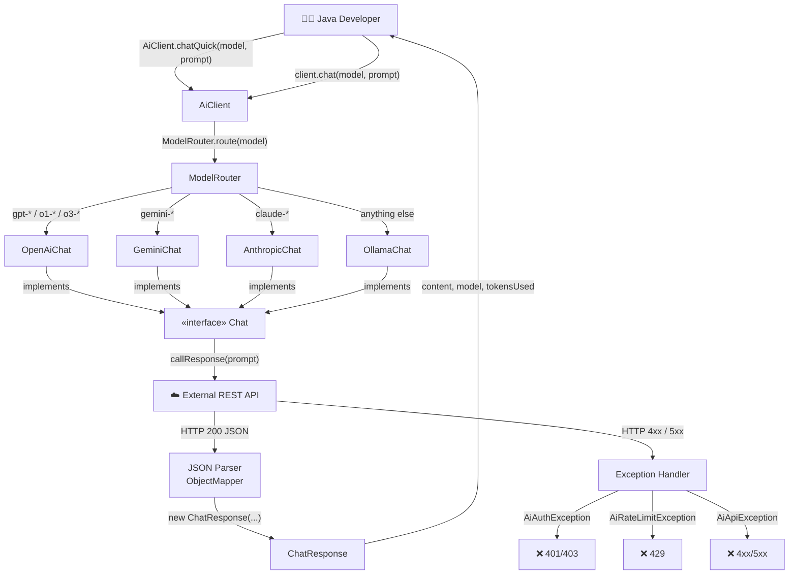
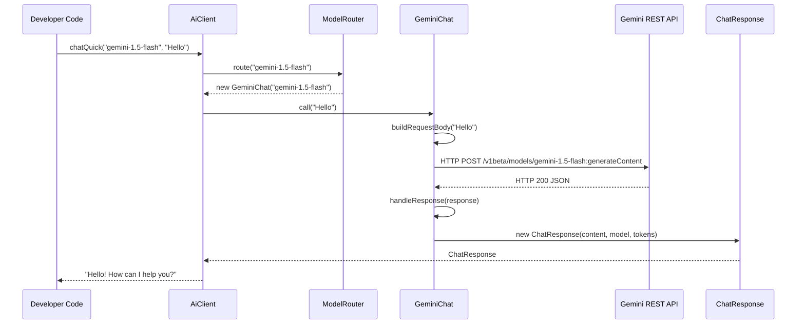
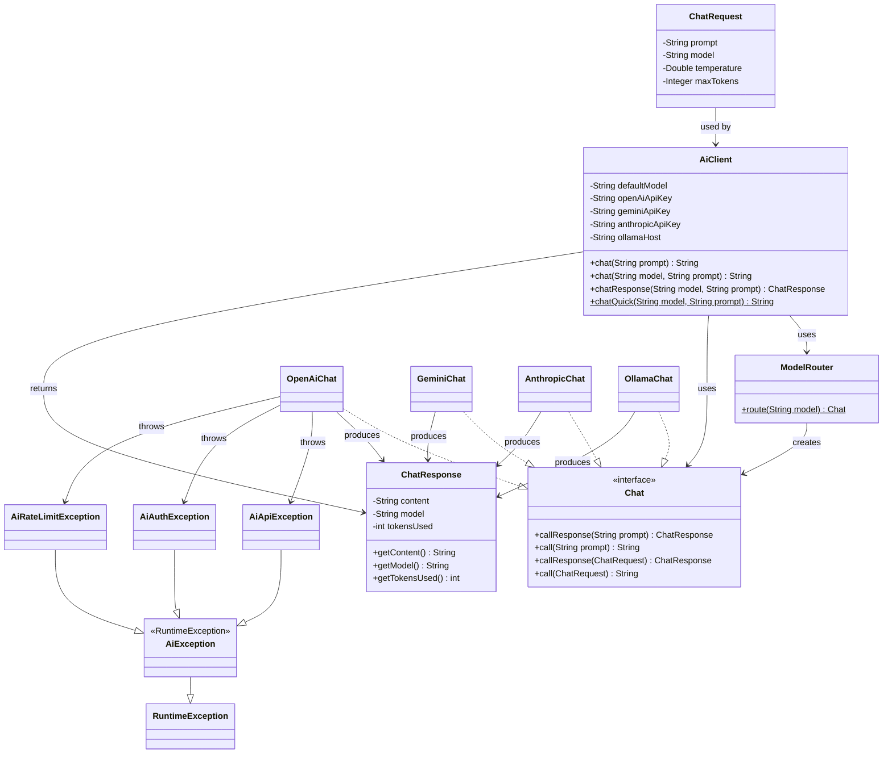

# sidd-ai — Architecture & Design Guide

> A Java SDK for calling multiple AI providers with Python-like simplicity.

---

## Table of Contents
1. [Project Overview](#1-project-overview)
2. [Project Structure](#2-project-structure)
3. [System Architecture Diagram](#3-system-architecture-diagram)
4. [Component Interaction Flow](#4-component-interaction-flow)
5. [Design Patterns Used](#5-design-patterns-used)
6. [Class Dependency Map](#6-class-dependency-map)
7. [Provider API Details](#7-provider-api-details)

---

## 1. Project Overview

`sidd-ai` is a Java library that lets you call any AI provider (OpenAI, Gemini, Anthropic, Ollama) using a single unified API — similar to how Python libraries like `openai` or `google-generativeai` work. You provide a model name and a prompt; the library handles routing, HTTP communication, JSON parsing, and error classification automatically.

**Before sidd-ai (verbose Java):**
```java
HttpClient client = HttpClient.newHttpClient();
String body = "{\"model\":\"gpt-4o\",\"messages\":[{\"role\":\"user\",\"content\":\"Hello\"}]}";
HttpRequest req = HttpRequest.newBuilder()
    .uri(URI.create("https://api.openai.com/v1/chat/completions"))
    .header("Authorization", "Bearer " + System.getenv("OPENAI_API_KEY"))
    .POST(HttpRequest.BodyPublishers.ofString(body))
    .build();
// ... parse response manually
```

**With sidd-ai (Python-like simplicity):**
```java
String reply = AiClient.chatQuick("gpt-4o", "Hello, what is Java?");
System.out.println(reply);
```

---

## 2. Project Structure

```
sidd-ai/
├── pom.xml                                          ← Maven build config (deps, Java version)
├── LEARNING_GUIDE.md                                ← Line-by-line code walkthrough
├── ARCHITECTURE.md                                  ← This file
└── src/
    ├── main/java/io/github/prabhusiddarth/sidd_ai/
    │   ├── AiClient.java                            ← Main entry point / facade
    │   ├── Chat.java                                ← Provider interface (Strategy contract)
    │   ├── ChatRequest.java                         ← Request model (Builder pattern)
    │   ├── ChatResponse.java                        ← Response model (immutable POJO)
    │   ├── exceptions/
    │   │   ├── AiException.java                     ← Root unchecked exception
    │   │   ├── AiApiException.java                  ← HTTP/network errors
    │   │   ├── AiAuthException.java                 ← 401/403 auth failures
    │   │   └── AiRateLimitException.java            ← 429 rate limit errors
    │   ├── providers/
    │   │   ├── OpenAiChat.java                      ← OpenAI GPT integration
    │   │   ├── GeminiChat.java                      ← Google Gemini integration
    │   │   ├── AnthropicChat.java                   ← Anthropic Claude integration
    │   │   └── OllamaChat.java                      ← Ollama local models integration
    │   └── router/
    │       └── ModelRouter.java                     ← Routes model name → provider
    └── test/java/io/github/prabhusiddarth/sidd_ai/
        ├── AiClientTest.java
        ├── providers/
        │   ├── OpenAiChatTest.java
        │   ├── GeminiChatTest.java
        │   ├── AnthropicChatTest.java
        │   └── OllamaChatTest.java
        └── router/
            └── ModelRouterTest.java
```

---

## 3. System Architecture Diagram

The full request/response lifecycle across all components:



---

## 4. Component Interaction Flow

This sequence diagram shows exactly what happens when you call `AiClient.chatQuick("gemini-1.5-flash", "Hello")`:



---

## 5. Design Patterns Used

### ① Strategy Pattern — `Chat` Interface

**Location:** `Chat.java` + all 4 provider classes

**What it is:** Define a family of algorithms, encapsulate each one, and make them interchangeable.

**How we used it:**
```
Chat (interface)
  ├── OpenAiChat   → Strategy A: OpenAI GPT via REST
  ├── GeminiChat   → Strategy B: Google Gemini via REST
  ├── AnthropicChat → Strategy C: Anthropic Claude via REST
  └── OllamaChat   → Strategy D: Ollama local models
```

The `AiClient` and `ModelRouter` code against the `Chat` interface — they never care which provider is actually running. This means:
- You can swap providers at runtime
- Adding a new provider (e.g. `MistralChat`) only requires creating one new class that implements `Chat` — nothing else changes

---

### ② Router / Factory Pattern — `ModelRouter`

**Location:** `ModelRouter.java`

**What it is:** A static factory that creates objects based on a runtime condition (the model name prefix).

**How we used it:**
```java
public static Chat route(String model) {
    if (model.startsWith("gpt-"))     return new OpenAiChat(model);
    if (model.startsWith("gemini-")) return new GeminiChat(model);
    if (model.startsWith("claude-")) return new AnthropicChat(model);
    return new OllamaChat(model);  // default: local Ollama
}
```

**Why:** This hides provider selection logic from the developer. You just say `"gemini-1.5-flash"` and the library figures out which class to instantiate. It's the same reason Python's `openai.chat.completions.create(model="gpt-4o")` feels intuitive.

---

### ③ Builder Pattern — `ChatRequest` & `AiClient`

**Location:** `ChatRequest.java`, `AiClient.java`

**What it is:** Construct complex objects step-by-step using a fluent API, rather than overloaded constructors.

**How we used it:**

For configuring requests with optional parameters:
```java
ChatRequest request = ChatRequest.builder()
    .prompt("Explain black holes")
    .temperature(0.7)
    .maxTokens(512)
    .build();
```

For configuring the client with custom API keys:
```java
AiClient client = AiClient.builder()
    .defaultModel("gpt-4o")
    .openAiApiKey("sk-...")
    .geminiApiKey("AI...")
    .build();
```

**Why:** Without builders, a constructor with 5 optional fields is hard to use and easy to get wrong. The builder makes it self-documenting, readable, and safe — `build()` validates before creating the object.

---

### ④ Facade Pattern — `AiClient`

**Location:** `AiClient.java`

**What it is:** Provide a simple, unified interface to a complex subsystem (HTTP, JSON, routing, exception handling).

**How we used it:** `AiClient` hides all complexity. Internally it orchestrates:
1. Routing the model name via `ModelRouter`
2. Instantiating the right provider with the right API key
3. Calling the provider's HTTP request logic
4. Returning the clean `ChatResponse`

```java
// This single line triggers all of the above internally:
String reply = AiClient.chatQuick("gpt-4o", "Hello");
```

---

## 6. Class Dependency Map



---

## 7. Provider API Details

| Provider | Class | Endpoint | Auth Method | Response JSON Path |
|---|---|---|---|---|
| **OpenAI** | `OpenAiChat` | `https://api.openai.com/v1/chat/completions` | `Authorization: Bearer KEY` | `/choices/0/message/content` |
| **Gemini** | `GeminiChat` | `...googleapis.com/v1beta/models/{model}:generateContent?key=KEY` | Query param `key` | `/candidates/0/content/parts/0/text` |
| **Anthropic** | `AnthropicChat` | `https://api.anthropic.com/v1/messages` | `x-api-key: KEY` header | `/content/0/text` |
| **Ollama** | `OllamaChat` | `http://localhost:11434/api/chat` | None (local) | `/message/content` |

| Provider | Env Variable | Model Prefix Routing |
|---|---|---|
| OpenAI | `OPENAI_API_KEY` | `gpt-`, `o1-`, `o3-` |
| Gemini | `GEMINI_API_KEY` | `gemini-` |
| Anthropic | `ANTHROPIC_API_KEY` | `claude-` |
| Ollama | `OLLAMA_HOST` (optional) | anything else |
