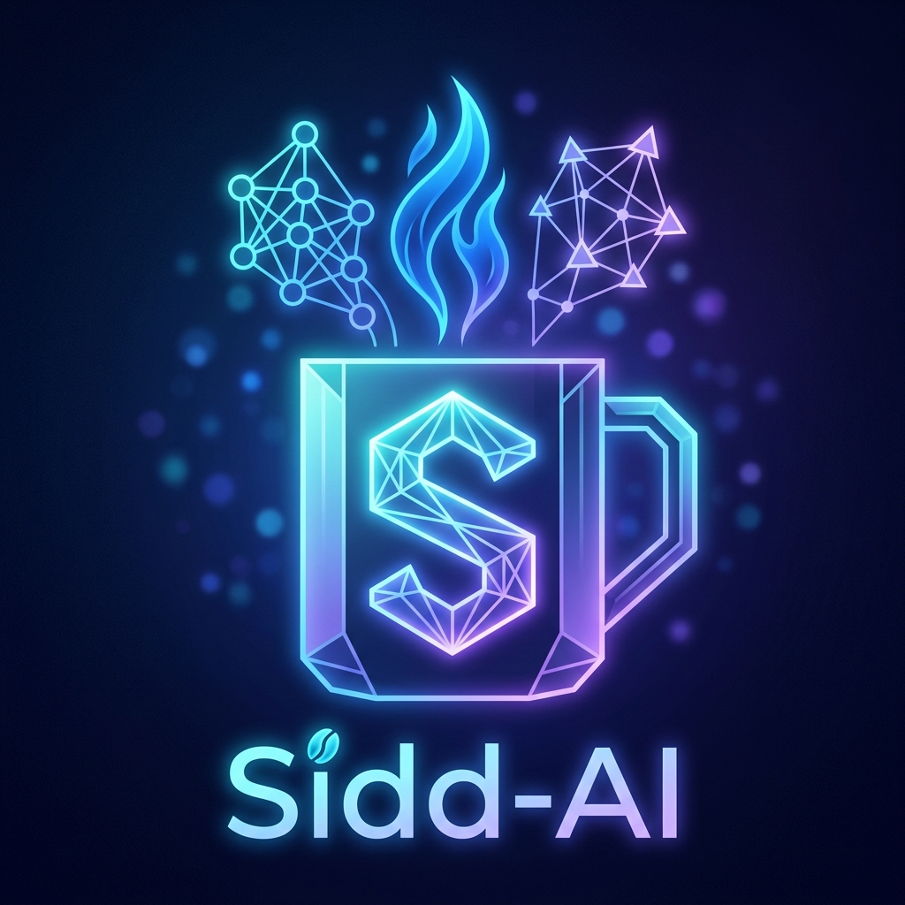

<div align="center">




<br/>

[](https://central.sonatype.com/artifact/io.github.prabhusiddarth/sidd-ai)
[](https://github.com/PRABHUSIDDARTH/sidd-ai/releases)
[](LICENSE)
[](https://openjdk.org/)

[](https://github.com/PRABHUSIDDARTH/sidd-ai/stargazers)
[](https://github.com/PRABHUSIDDARTH/sidd-ai/network/members)

</div>

---

## ⚡ What is `sidd-ai`?

A lightweight, **framework-agnostic** Java SDK for calling any major AI model — OpenAI, Google Gemini, Anthropic Claude, or local Ollama — through **one unified API**. No Spring context, no dependency injection, no `application.yml`. Just plain Java, anywhere Java runs.

Think of it as what **LiteLLM** is to Python, but for Java.


```java
String response = AiClient.chatQuick("gpt-4o", "Explain recursion in one sentence");
System.out.println(response);
```

That's it. That's the whole setup.

---

## 🎯 Why sidd-ai?

| | Spring AI | LangChain4j | **sidd-ai** |
|---|:---:|:---:|:---:|
| Zero framework required | ❌ | ⚠️ | ✅ |
| Works in plain `main()` | ❌ | ⚠️ | ✅ |
| One-line quick calls | ❌ | ❌ | ✅ |
| Unified exception hierarchy | ⚠️ | ⚠️ | ✅ |
| Model swap via string | ✅ | ✅ | ✅ |

---

## 📦 Installation

### Maven Central (recommended)

```xml
<dependency>
    <groupId>io.github.prabhusiddarth</groupId>
    <artifactId>sidd-ai</artifactId>
    <version>1.0.4</version>
</dependency>
```

### Gradle

```groovy
implementation 'io.github.prabhusiddarth:sidd-ai:1.0.4'
```

### No build tool? No problem.

Download the pre-built fat jar (all dependencies bundled) straight from [GitHub Releases](https://github.com/PRABHUSIDDARTH/sidd-ai/releases) — drag it into your project's classpath, no Maven or Gradle needed.

```bash
curl -L -o sidd-ai.jar https://github.com/PRABHUSIDDARTH/sidd-ai/releases/latest/download/sidd-ai-1.0.4-all.jar
javac -cp sidd-ai.jar Main.java
java -cp .:sidd-ai.jar Main
```

---

## 🚀 Quick Start

### 1. Zero-config static call

Reads API keys automatically from environment variables or a local `.env` file.

```java
import io.github.prabhusiddarth.sidd_ai.AiClient;

public class QuickStart {
    public static void main(String[] args) {
        String response = AiClient.chatQuick("gemini-2.5-flash", "Solve: 23 * 45");
        System.out.println(response);
    }
}
```

### 2. Client builder for real applications

```java
import io.github.prabhusiddarth.sidd_ai.AiClient;
import io.github.prabhusiddarth.sidd_ai.ChatResponse;

AiClient client = AiClient.builder()
        .openAiApiKey("sk-...")
        .geminiApiKey("AIza...")
        .grokApiKey("xai-...")
        .nimApiKey("nvapi-...")
        .kimiApiKey("sk-kimi-...")
        .defaultModel("gemini-2.5-flash")
        .build();

String answer = client.chat("Explain photosynthesis in one sentence.");

ChatResponse details = client.chatResponse("grok-3", "Hello Grok!");
System.out.println("Tokens used: " + details.getTokensUsed());
```

### 3. Swap providers by changing one string

```java
AiClient.chatQuick("gpt-4o", prompt);                       // OpenAI
AiClient.chatQuick("gemini-2.5-flash", prompt);              // Google Gemini
AiClient.chatQuick("claude-3-5-sonnet", prompt);             // Anthropic
AiClient.chatQuick("grok-3", prompt);                        // xAI Grok
AiClient.chatQuick("deepseek-ai/deepseek-r1", prompt);       // NVIDIA NIM
AiClient.chatQuick("moonshot-v1-8k", prompt);                // Moonshot Kimi
AiClient.chatQuick("llama3.2", prompt);                      // Local Ollama
```

### 4. Explicit provider selection (bypass prefix routing)

```java
// Useful when the model name has no recognizable prefix
String response = client.chatWithProvider("nim", "meta/llama-3.1-8b-instruct", prompt);
```

### 5. Resilient error handling

```java
import io.github.prabhusiddarth.sidd_ai.exceptions.*;

try {
    String answer = AiClient.chatQuick("claude-3-5-sonnet", "Write a haiku about code");
} catch (AiAuthException e) {
    System.err.println("Check your ANTHROPIC_API_KEY");
} catch (AiRateLimitException e) {
    System.err.println("Rate limited — back off and retry");
} catch (AiApiException e) {
    System.err.println("API error: " + e.getMessage());
}
```

---

## 🧩 Supported Providers

<div align="center">

| Provider | Model prefix(es) | Example |
|---|---|---|
| 🟢 OpenAI | `gpt-`, `o1-`, `o3-` | `gpt-4o` |
| 🔵 Google Gemini | `gemini-` | `gemini-2.5-flash` |
| 🟣 Anthropic Claude | `claude-` | `claude-3-5-sonnet` |
| ⚡ xAI Grok | `grok-` | `grok-3` |
| 🔶 NVIDIA NIM | `nvidia/`, `nim-`, `deepseek-ai/`, `meta/`, `mistralai/`, `microsoft/`, `ibm/`, `qwen/`, and more | `nvidia/llama-3.1-nemotron-ultra-253b-v1` |
| 🌙 Moonshot Kimi | `moonshot-`, `kimi-`, `moonshotai/` | `moonshot-v1-8k` |
| ⚪ Ollama (local) | anything else | `llama3.2` |

</div>

Routing is **automatic** — `ModelRouter` reads the model string prefix and instantiates the right provider under the hood. No manual imports of provider-specific classes needed. You can also bypass prefix routing entirely using `client.chatWithProvider("nim", model, prompt)` to explicitly select a provider.

---

## 📖 Full API Reference

See [`API_REFERENCE.md`](API_REFERENCE.md) for every class, method, and exception in the library.

---

## 🛠️ Building from source

```bash
git clone https://github.com/PRABHUSIDDARTH/sidd-ai.git
cd sidd-ai
mvn clean install
```

Runs the full test suite (across all providers and the router) and installs to your local `.m2` repository.

---

## 🤝 Contributing

Contributions are welcome — especially new provider implementations. Each provider is a single class implementing the `Chat` interface, so adding one is straightforward:

1. Implement `Chat` for your provider (see `OpenAiChat` as reference)
2. Register the prefix in `ModelRouter`
3. Add tests
4. Open a PR

---

## 📄 License

Apache License 2.0 — see [LICENSE](LICENSE) for details.

---

<div align="center">


[](https://github.com/PRABHUSIDDARTH)


</div>
